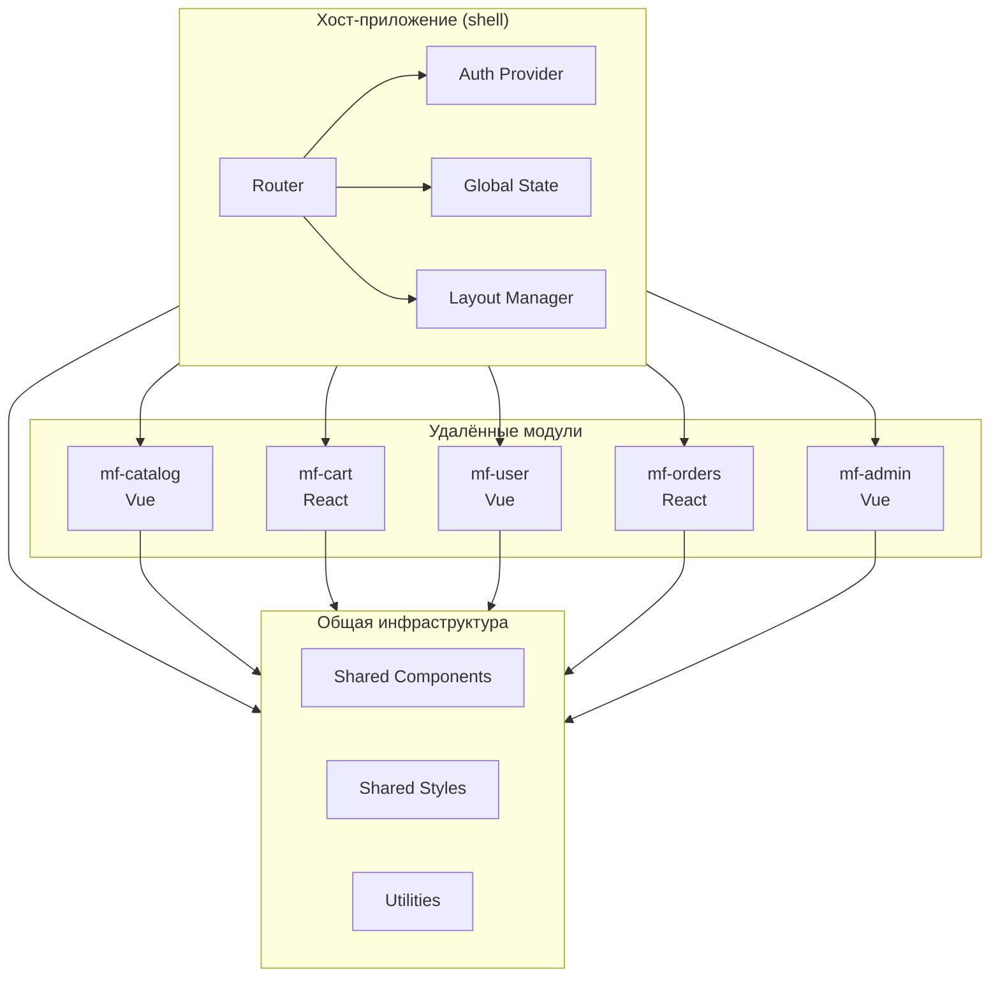
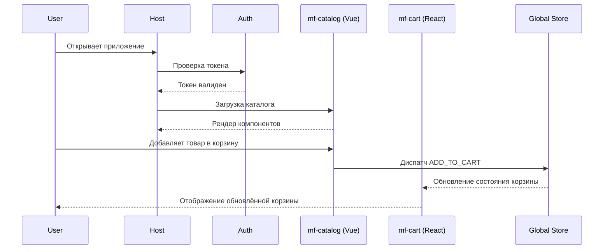
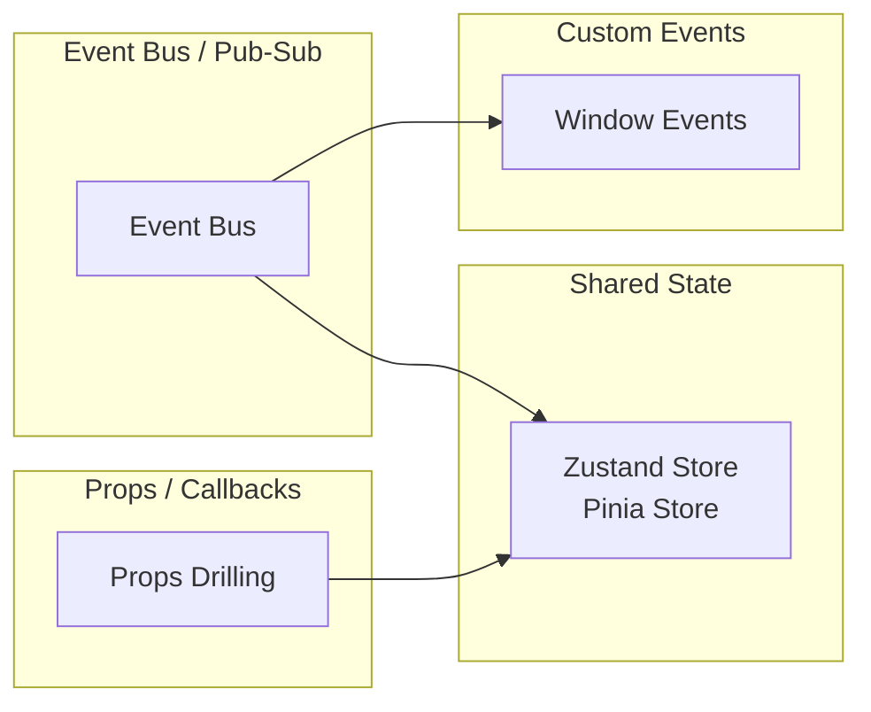
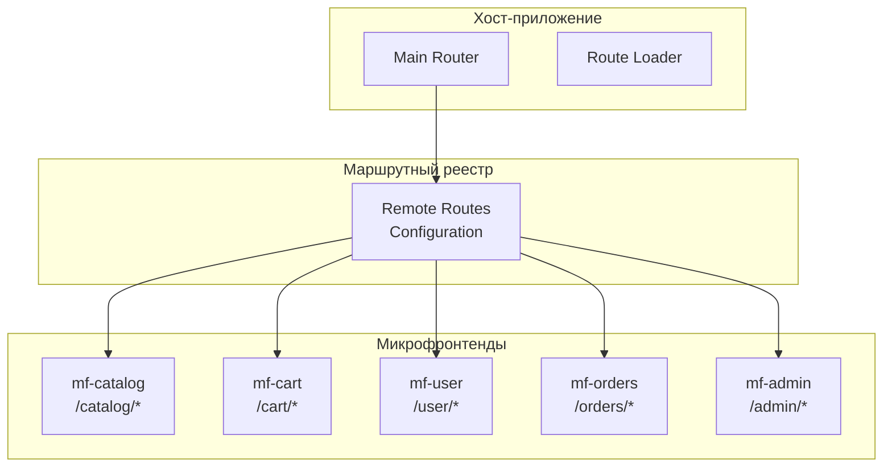
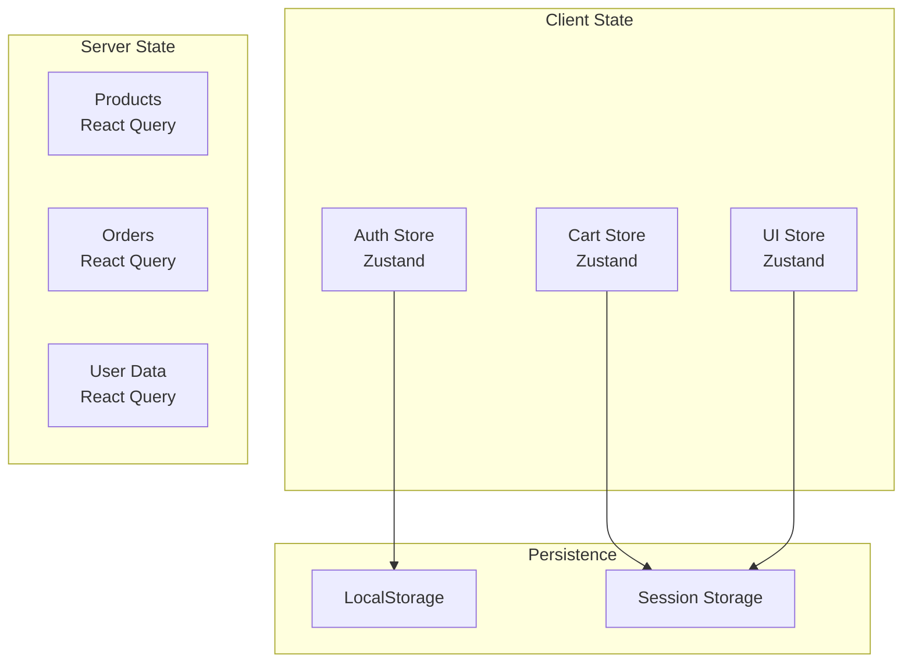
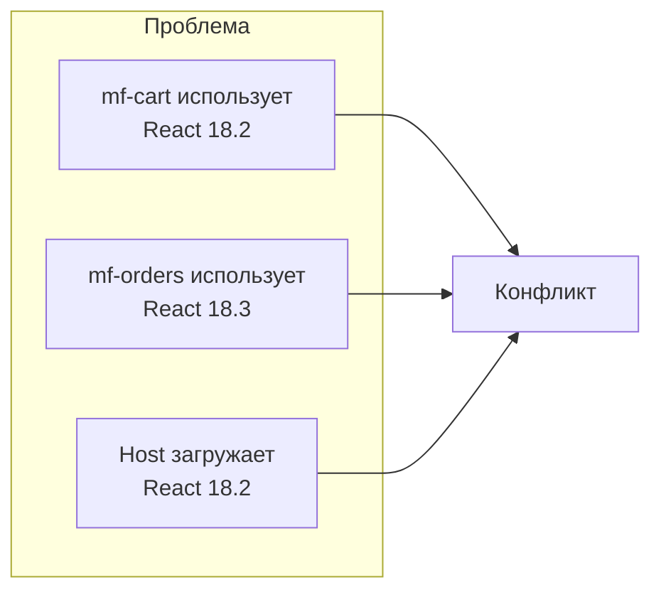

# Техническое задание: Микрофронтенд приложение внутреннего магазина компании

## Введение

### Цель проекта

Разработка микрофронтенд приложения внутреннего магазина компании (Corporate Internal Store) с использованием технологии Module Federation (Vite), обеспечивающей совместную работу Vue 3 и React 18 компонентов в едином пользовательском интерфейсе.

### Определения и сокращения

| Термин | Определение |
|--------|-------------|
| MF (Micro-Frontend) | Микрофронтенд — независимо развертываемый фрагмент фронтенд-приложения |
| Host (Container) | Основное приложение-контейнер, загружающее удалённые модули |
| Remote | Удалённый микрофронтенд, предоставляющий компоненты для хоста |
| Module Federation | Механизм Webpack/Vite для декомпозиции приложения на независимые части |
| Shared Library | Общая библиотека компонентов, используемая несколькими MF |

### Применимые стандарты

- JavaScript ES2022+
- TypeScript 5.x
- Vite 5.x с плагином `vite-plugin-federation`
- Vue 3.4+ (Composition API)
- React 18.2+
- CSS Modules + CSS Variables

---

## 1. Архитектура приложения

### 1.1 Общая схема архитектуры



### 1.2 Типы микрофронтендов

| Название | Фреймворк | Ответственность |
|----------|----------|-----------------|
| `mf-catalog` | Vue 3 | Каталог товаров, поиск, фильтры |
| `mf-cart` | React 18 | Корзина покупок, оформление заказа |
| `mf-user` | Vue 3 | Профиль пользователя, история |
| `mf-orders` | React 18 | Управление заказами |
| `mf-admin` | Vue 3 | Административная панель |

### 1.3 Схема потоков данных



---

## 2. Структура репозитория

### 2.1 Монорепозиторий (pnpm workspaces)

```
pet-store/
├── package.json                    # Корневой package.json
├── pnpm-workspace.yaml             # Конфигурация workspaces
├── turbo.json                      # Turborepo конфигурация
├── .eslintrc.cjs                   # ESLint конфиг
├── .prettierrc                     # Prettier конфиг
├── tsconfig.base.json              # Базовый TS config
├── .env.example                    # Пример переменных окружения
│
├── apps/                           # Микрофронтенды
│   ├── host/                       # Хост-приложение (Shell)
│   │   ├── src/
│   │   │   ├── main.ts
│   │   │   ├── App.vue
│   │   │   ├── router/
│   │   │   ├── components/
│   │   │   └── layouts/
│   │   ├── index.html
│   │   ├── vite.config.ts
│   │   └── package.json
│   │
│   ├── mf-catalog/                 # Микрофронтенд каталога (Vue)
│   │   ├── src/
│   │   │   ├── main.ts
│   │   │   ├── App.vue
│   │   │   ├── components/
│   │   │   ├── composables/
│   │   │   └── views/
│   │   ├── index.html
│   │   ├── vite.config.ts
│   │   └── package.json
│   │
│   ├── mf-cart/                    # Микрофронтенд корзины (React)
│   │   ├── src/
│   │   │   ├── main.tsx
│   │   │   ├── App.tsx
│   │   │   ├── components/
│   │   │   └── pages/
│   │   ├── index.html
│   │   ├── vite.config.ts
│   │   └── package.json
│   │
│   ├── mf-user/                   # Микрофронтенд пользователей (Vue)
│   │   ├── src/
│   │   │   ├── main.ts
│   │   │   ├── App.vue
│   │   │   ├── components/
│   │   │   └── views/
│   │   ├── index.html
│   │   ├── vite.config.ts
│   │   └── package.json
│   │
│   ├── mf-orders/                 # Микрофронтенд заказов (React)
│   │   ├── src/
│   │   │   ├── main.tsx
│   │   │   ├── App.tsx
│   │   │   ├── components/
│   │   │   └── pages/
│   │   ├── index.html
│   │   ├── vite.config.ts
│   │   └── package.json
│   │
│   └── mf-admin/                  # Микрофронтенд админки (Vue)
│       ├── src/
│       │   ├── main.ts
│       │   ├── App.vue
│       │   ├── components/
│       │   └── views/
│       ├── index.html
│       ├── vite.config.ts
│       └── package.json
│
├── packages/                      # Общие пакеты
│   ├── shared/                    # Общая библиотека
│   │   ├── src/
│   │   │   ├── components/        # Общие UI компоненты
│   │   │   ├── hooks/             # Общие хуки
│   │   │   ├── stores/            # Shared stores (Zustand/Pinia)
│   │   │   ├── types/             # TypeScript типы
│   │   │   ├── utils/             # Утилиты
│   │   │   └── styles/            # Глобальные стили
│   │   ├── package.json
│   │   ├── tsconfig.json
│   │   └── vite.config.ts
│   │
│   ├── auth/                      # Аутентификация
│   │   ├── src/
│   │   │   ├── AuthProvider.tsx   # React провайдер
│   │   │   ├── useAuth.ts         # Vue composable
│   │   │   ├── tokenStorage.ts
│   │   │   └── types.ts
│   │   └── package.json
│   │
│   └── routing/                   # Общая маршрутизация
│       ├── src/
│       │   ├── routes.config.ts
│       │   └── RouteGuard.tsx
│       └── package.json
│
└── configs/                       # Общие конфигурации
    ├── types/                     # Глобальные типы
    └── constants/                 # Константы приложения
```

### 2.2 Альтернативная структура (отдельные репозитории)

```
organization/
├── pet-store-host/               # Хост-приложение
├── pet-store-catalog/            # MF каталог (Vue)
├── pet-store-cart/               # MF корзины (React)
├── pet-store-user/               # MF пользователей (Vue)
├── pet-store-orders/             # MF заказов (React)
├── pet-store-admin/              # MF админки (Vue)
├── pet-store-shared/             # Общая библиотека
└── pet-store-auth/               # Общая аутентификация
```

**Рекомендация:** Для начала использовать монорепозиторий для упрощения разработки и тестирования.

---

## 3. Конфигурация Vite Module Federation

### 3.1 Хост-приложение (apps/host/vite.config.ts)

```typescript
import { defineConfig } from 'vite'
import vue from '@vitejs/plugin-vue'
import react from '@vitejs/plugin-react'
import federation from 'vite-plugin-federation'
import { resolve } from 'path'

export default defineConfig({
  plugins: [
    vue(),
    react(),
    federation({
      name: 'host',
      filename: 'remoteEntry.js',
      
      // Удалённые модули
      remotes: {
        mfCatalog: 'http://localhost:4173/assets/mf-catalog/remoteEntry.js',
        mfCart: 'http://localhost:4174/assets/mf-cart/remoteEntry.js',
        mfUser: 'http://localhost:4175/assets/mf-user/remoteEntry.js',
        mfOrders: 'http://localhost:4176/assets/mf-orders/remoteEntry.js',
        mfAdmin: 'http://localhost:4177/assets/mf-admin/remoteEntry.js',
      },
      
      // Общие зависимости
      shared: {
        vue: { singleton: true, requiredVersion: '^3.4.0', eager: true },
        'vue-router': { singleton: true, requiredVersion: '^4.2.0' },
        pinia: { singleton: true, requiredVersion: '^2.1.0' },
        
        react: { singleton: true, requiredVersion: '^18.2.0', eager: true },
        'react-dom': { singleton: true, requiredVersion: '^18.2.0', eager: true },
        'react-router-dom': { singleton: true, requiredVersion: '^6.20.0' },
        
        // Утилиты
        axios: { singleton: true, requiredVersion: '^1.6.0' },
        zustand: { singleton: true, requiredVersion: '^4.4.0' },
      }
    })
  ],
  
  resolve: {
    alias: {
      '@': resolve(__dirname, './src'),
      '@shared': resolve(__dirname, '../../packages/shared/src'),
    }
  },
  
  build: {
    target: 'esnext',
    rollupOptions: {
      output: {
        assetFileNames: 'assets/[name]-[hash][extname]',
        chunkFileNames: 'assets/[name]-[hash].js',
        entryFileNames: 'assets/[name]-[hash].js',
      }
    }
  },
  
  server: {
    port: 4170,
    strictPort: true,
  }
})
```

### 3.2 Vue микрофронтенд (mf-catalog/vite.config.ts)

```typescript
import { defineConfig } from 'vite'
import vue from '@vitejs/plugin-vue'
import federation from 'vite-plugin-federation'
import { resolve } from 'path'

export default defineConfig({
  plugins: [
    vue(),
    federation({
      name: 'mf_catalog',
      filename: 'remoteEntry.js',
      
      // Экспортируемые модули
      exposes: {
        './CatalogApp': './src/App.vue',
        './ProductList': './src/components/ProductList.vue',
        './ProductCard': './src/components/ProductCard.vue',
        './ProductFilter': './src/components/ProductFilter.vue',
        './SearchBar': './src/components/SearchBar.vue',
      },
      
      // Общие зависимости
      shared: {
        vue: { singleton: true, requiredVersion: '^3.4.0', eager: true },
        'vue-router': { singleton: true, requiredVersion: '^4.2.0' },
        pinia: { singleton: true, requiredVersion: '^2.1.0' },
        axios: { singleton: true, requiredVersion: '^1.6.0' },
      }
    })
  ],
  
  resolve: {
    alias: {
      '@': resolve(__dirname, './src'),
      '@shared': resolve(__dirname, '../../../packages/shared/src'),
    }
  },
  
  build: {
    target: 'esnext',
    rollupOptions: {
      output: {
        assetFileNames: 'assets/mf-catalog/[name]-[hash][extname]',
        chunkFileNames: 'assets/mf-catalog/[name]-[hash].js',
        entryFileNames: 'assets/mf-catalog/[name]-[hash].js',
      }
    }
  },
  
  server: {
    port: 4173,
    strictPort: true,
  }
})
```

### 3.3 React микрофронтенд (mf-cart/vite.config.ts)

```typescript
import { defineConfig } from 'vite'
import react from '@vitejs/plugin-react'
import federation from 'vite-plugin-federation'
import { resolve } from 'path'

export default defineConfig({
  plugins: [
    react(),
    federation({
      name: 'mf_cart',
      filename: 'remoteEntry.js',
      
      // Экспортируемые модули
      exposes: {
        './CartApp': './src/App',
        './Cart': './src/components/Cart',
        './CartItem': './src/components/CartItem',
        './Checkout': './src/components/Checkout',
        './CheckoutForm': './src/components/CheckoutForm',
      },
      
      // Общие зависимости
      shared: {
        react: { singleton: true, requiredVersion: '^18.2.0', eager: true },
        'react-dom': { singleton: true, requiredVersion: '^18.2.0', eager: true },
        'react-router-dom': { singleton: true, requiredVersion: '^6.20.0' },
        axios: { singleton: true, requiredVersion: '^1.6.0' },
        zustand: { singleton: true, requiredVersion: '^4.4.0' },
      }
    })
  ],
  
  resolve: {
    alias: {
      '@': resolve(__dirname, './src'),
      '@shared': resolve(__dirname, '../../../packages/shared/src'),
    }
  },
  
  build: {
    target: 'esnext',
    rollupOptions: {
      output: {
        assetFileNames: 'assets/mf-cart/[name]-[hash][extname]',
        chunkFileNames: 'assets/mf-cart/[name]-[hash].js',
        entryFileNames: 'assets/mf-cart/[name]-[hash].js',
      }
    }
  },
  
  server: {
    port: 4174,
    strictPort: true,
  }
})
```

### 3.4 Конфигурация Package.json (корневой)

```json
{
  "name": "pet-store",
  "version": "1.0.0",
  "private": true,
  "type": "module",
  "scripts": {
    "dev:host": "pnpm --filter host dev",
    "dev:catalog": "pnpm --filter mf-catalog dev",
    "dev:cart": "pnpm --filter mf-cart dev",
    "dev:user": "pnpm --filter mf-user dev",
    "dev:orders": "pnpm --filter mf-orders dev",
    "dev:admin": "pnpm --filter mf-admin dev",
    "dev:all": "pnpm -r --parallel -r dev",
    "build": "pnpm -r build",
    "build:host": "pnpm --filter host build",
    "preview": "pnpm --filter host preview",
    "lint": "eslint . --ext .ts,.tsx,.vue",
    "test": "pnpm -r test",
    "typecheck": "pnpm -r typecheck"
  },
  "devDependencies": {
    "@typescript-eslint/eslint-plugin": "^6.15.0",
    "@typescript-eslint/parser": "^6.15.0",
    "eslint": "^8.56.0",
    "eslint-plugin-vue": "^9.19.0",
    "prettier": "^3.1.1",
    "turbo": "^1.11.3",
    "typescript": "^5.3.3",
    "vite": "^5.0.10"
  }
}
```

---

## 4. Коммуникация между микрофронтендами

### 4.1 Архитектура коммуникации



### 4.2 Global Event Bus (общий пакет)

```typescript
// packages/shared/src/events/EventBus.ts
type EventCallback<T = any> = (data: T) => void;
type UnsubscribeFn = () => void;

class EventBus {
  private listeners: Map<string, Set<EventCallback>> = new Map();
  
  subscribe<T>(event: string, callback: EventCallback<T>): UnsubscribeFn {
    if (!this.listeners.has(event)) {
      this.listeners.set(event, new Set());
    }
    
    this.listeners.get(event)!.add(callback);
    
    return () => {
      this.listeners.get(event)?.delete(callback);
    };
  }
  
  publish<T>(event: string, data: T): void {
    this.listeners.get(event)?.forEach(callback => {
      try {
        callback(data);
      } catch (error) {
        console.error(`Error in event handler for "${event}":`, error);
      }
    });
  }
  
  // Предопределённые события
  static readonly EVENTS = {
    ADD_TO_CART: 'cart:add',
    REMOVE_FROM_CART: 'cart:remove',
    CART_UPDATED: 'cart:updated',
    USER_LOGGED_IN: 'auth:login',
    USER_LOGGED_OUT: 'auth:logout',
    ORDER_CREATED: 'order:created',
    ORDER_UPDATED: 'order:updated',
    THEME_CHANGED: 'theme:changed',
    LANGUAGE_CHANGED: 'i18n:changed',
  } as const;
}

export const eventBus = new EventBus();
export type { EventCallback, UnsubscribeFn };
```

### 4.3 Shared Store (Zustand)

```typescript
// packages/shared/src/stores/cartStore.ts
import { create } from 'zustand';
import { persist } from 'zustand/middleware';

export interface CartItem {
  id: string;
  productId: string;
  name: string;
  price: number;
  quantity: number;
  image?: string;
}

interface CartState {
  items: CartItem[];
  totalItems: number;
  totalPrice: number;
  
  addItem: (item: Omit<CartItem, 'id'>) => void;
  removeItem: (productId: string) => void;
  updateQuantity: (productId: string, quantity: number) => void;
  clearCart: () => void;
}

export const useCartStore = create<CartState>()(
  persist(
    (set, get) => ({
      items: [],
      totalItems: 0,
      totalPrice: 0,
      
      addItem: (item) => {
        const items = get().items;
        const existingItem = items.find(i => i.productId === item.productId);
        
        if (existingItem) {
          set({
            items: items.map(i =>
              i.productId === item.productId
                ? { ...i, quantity: i.quantity + item.quantity }
                : i
            ),
          });
        } else {
          set({
            items: [...items, { ...item, id: crypto.randomUUID() }],
          });
        }
        
        // Пересчёт totals
        const newItems = get().items;
        set({
          totalItems: newItems.reduce((sum, i) => sum + i.quantity, 0),
          totalPrice: newItems.reduce((sum, i) => sum + i.price * i.quantity, 0),
        });
        
        // Публикация события
        import('../events/EventBus').then(({ eventBus }) => {
          eventBus.publish(eventBus.EVENTS.CART_UPDATED, get().items);
        });
      },
      
      removeItem: (productId) => {
        set(state => ({
          items: state.items.filter(i => i.productId !== productId),
        }));
        
        const newItems = get().items;
        set({
          totalItems: newItems.reduce((sum, i) => sum + i.quantity, 0),
          totalPrice: newItems.reduce((sum, i) => sum + i.price * i.quantity, 0),
        });
      },
      
      updateQuantity: (productId, quantity) => {
        if (quantity <= 0) {
          get().removeItem(productId);
          return;
        }
        
        set(state => ({
          items: state.items.map(i =>
            i.productId === productId ? { ...i, quantity } : i
          ),
        }));
        
        const newItems = get().items;
        set({
          totalItems: newItems.reduce((sum, i) => sum + i.quantity, 0),
          totalPrice: newItems.reduce((sum, i) => sum + i.price * i.quantity, 0),
        });
      },
      
      clearCart: () => {
        set({ items: [], totalItems: 0, totalPrice: 0 });
      },
    }),
    {
      name: 'cart-storage',
    }
  )
);
```

### 4.4 Vue Pinia Store (адаптер)

```typescript
// packages/shared/src/stores/piniaCartAdapter.ts
import { ref, computed } from 'vue';
import { useCartStore, type CartItem } from './cartStore';

// Vue 3 composable адаптер для Zustand store
export function useCart() {
  const store = useCartStore();
  
  const items = ref(store.items) as { value: CartItem[] };
  const totalItems = computed(() => store.totalItems);
  const totalPrice = computed(() => store.totalPrice);
  
  function addItem(item: Omit<CartItem, 'id'>) {
    store.addItem(item);
  }
  
  function removeItem(productId: string) {
    store.removeItem(productId);
  }
  
  function updateQuantity(productId: string, quantity: number) {
    store.updateQuantity(productId, quantity);
  }
  
  function clearCart() {
    store.clearCart();
  }
  
  return {
    items,
    totalItems,
    totalPrice,
    addItem,
    removeItem,
    updateQuantity,
    clearCart,
  };
}
```

### 4.5 Пример использования в Vue компоненте

```vue
<!-- apps/mf-catalog/src/components/ProductCard.vue -->
<script setup lang="ts">
import { useCart } from '@shared/stores/piniaCartAdapter';
import type { Product } from '@shared/types';

const props = defineProps<{
  product: Product;
}>();

const { addItem } = useCart();

function handleAddToCart() {
  addItem({
    productId: props.product.id,
    name: props.product.name,
    price: props.product.price,
    quantity: 1,
    image: props.product.image,
  });
}
</script>

<template>
  <div class="product-card">
    
    <h3>{{ product.name }}</h3>
    <p>{{ product.price }} ₽</p>
    <button @click="handleAddToCart">В корзину</button>
  </div>
</template>
```

### 4.6 Пример использования в React компоненте

```tsx
// apps/mf-cart/src/components/CartItem.tsx
import { useCartStore, type CartItem } from '@shared/stores/cartStore';

interface CartItemProps {
  item: CartItem;
}

export function CartItem({ item }: CartItemProps) {
  const { updateQuantity, removeItem } = useCartStore();
  
  return (
    <div className="cart-item">
      
      <h3>{item.name}</h3>
      <p>{item.price} ₽</p>
      <div className="quantity-controls">
        <button onClick={() => updateQuantity(item.productId, item.quantity - 1)}>-</button>
        <span>{item.quantity}</span>
        <button onClick={() => updateQuantity(item.productId, item.quantity + 1)}>+</button>
      </div>
      <button onClick={() => removeItem(item.productId)}>Удалить</button>
    </div>
  );
}
```

---

## 5. Общие компоненты и стили

### 5.1 Структура Shared Library

```
packages/shared/
├── src/
│   ├── components/
│   │   ├── Button/
│   │   │   ├── Button.vue
│   │   │   ├── Button.tsx
│   │   │   └── index.ts
│   │   ├── Input/
│   │   ├── Modal/
│   │   ├── Card/
│   │   ├── Table/
│   │   ├── Spinner/
│   │   ├── Badge/
│   │   └── index.ts
│   │
│   ├── hooks/
│   │   ├── useAuth.ts
│   │   ├── useCart.ts
│   │   ├── useTheme.ts
│   │   └── index.ts
│   │
│   ├── stores/
│   │   ├── cartStore.ts
│   │   ├── authStore.ts
│   │   └── index.ts
│   │
│   ├── types/
│   │   ├── product.ts
│   │   ├── user.ts
│   │   ├── order.ts
│   │   └── index.ts
│   │
│   ├── utils/
│   │   ├── formatCurrency.ts
│   │   ├── validation.ts
│   │   └── api.ts
│   │
│   ├── styles/
│   │   ├── variables.css
│   │   ├── reset.css
│   │   ├── typography.css
│   │   └── index.css
│   │
│   └── events/
│       ├── EventBus.ts
│       └── index.ts
│
├── package.json
└── vite.config.ts
```

### 5.2 CSS Variables (Design Tokens)

```css
/* packages/shared/src/styles/variables.css */
:root {
  /* Цветовая палитра */
  --color-primary: #2563eb;
  --color-primary-hover: #1d4ed8;
  --color-secondary: #64748b;
  --color-success: #22c55e;
  --color-warning: #f59e0b;
  --color-error: #ef4444;
  
  /* Нейтральные цвета */
  --color-white: #ffffff;
  --color-gray-50: #f8fafc;
  --color-gray-100: #f1f5f9;
  --color-gray-200: #e2e8f0;
  --color-gray-300: #cbd5e1;
  --color-gray-400: #94a3b8;
  --color-gray-500: #64748b;
  --color-gray-600: #475569;
  --color-gray-700: #334155;
  --color-gray-800: #1e293b;
  --color-gray-900: #0f172a;
  --color-black: #000000;
  
  /* Типографика */
  --font-family-sans: 'Inter', system-ui, -apple-system, sans-serif;
  --font-family-mono: 'JetBrains Mono', monospace;
  
  --font-size-xs: 0.75rem;    /* 12px */
  --font-size-sm: 0.875rem;   /* 14px */
  --font-size-base: 1rem;      /* 16px */
  --font-size-lg: 1.125rem;   /* 18px */
  --font-size-xl: 1.25rem;    /* 20px */
  --font-size-2xl: 1.5rem;    /* 24px */
  --font-size-3xl: 1.875rem;  /* 30px */
  --font-size-4xl: 2.25rem;   /* 36px */
  
  --font-weight-normal: 400;
  --font-weight-medium: 500;
  --font-weight-semibold: 600;
  --font-weight-bold: 700;
  
  /* Отступы */
  --spacing-1: 0.25rem;   /* 4px */
  --spacing-2: 0.5rem;    /* 8px */
  --spacing-3: 0.75rem;   /* 12px */
  --spacing-4: 1rem;      /* 16px */
  --spacing-5: 1.25rem;  /* 20px */
  --spacing-6: 1.5rem;    /* 24px */
  --spacing-8: 2rem;      /* 32px */
  --spacing-10: 2.5rem;  /* 40px */
  --spacing-12: 3rem;    /* 48px */
  
  /* Границы */
  --border-radius-sm: 0.25rem;
  --border-radius: 0.375rem;
  --border-radius-md: 0.5rem;
  --border-radius-lg: 0.75rem;
  --border-radius-full: 9999px;
  
  --border-width: 1px;
  --border-color: var(--color-gray-200);
  
  /* Тени */
  --shadow-sm: 0 1px 2px 0 rgb(0 0 0 / 0.05);
  --shadow: 0 1px 3px 0 rgb(0 0 0 / 0.1), 0 1px 2px -1px rgb(0 0 0 / 0.1);
  --shadow-md: 0 4px 6px -1px rgb(0 0 0 / 0.1), 0 2px 4px -2px rgb(0 0 0 / 0.1);
  --shadow-lg: 0 10px 15px -3px rgb(0 0 0 / 0.1), 0 4px 6px -4px rgb(0 0 0 / 0.1);
  --shadow-xl: 0 20px 25px -5px rgb(0 0 0 / 0.1), 0 8px 10px -6px rgb(0 0 0 / 0.1);
  
  /* Transitions */
  --transition-fast: 150ms ease;
  --transition-base: 200ms ease;
  --transition-slow: 300ms ease;
  
  /* Z-index */
  --z-dropdown: 100;
  --z-modal: 200;
  --z-tooltip: 300;
  --z-toast: 400;
}
```

### 5.3 Универсальный Button (Vue + React)

```vue
<!-- packages/shared/src/components/Button/Button.vue -->
<script setup lang="ts">
interface Props {
  variant?: 'primary' | 'secondary' | 'danger' | 'ghost';
  size?: 'sm' | 'md' | 'lg';
  disabled?: boolean;
  loading?: boolean;
  type?: 'button' | 'submit' | 'reset';
}

withDefaults(defineProps<Props>(), {
  variant: 'primary',
  size: 'md',
  disabled: false,
  loading: false,
  type: 'button',
});

defineEmits<{
  click: [event: MouseEvent];
}>();
</script>

<template>
  <button
    :class="[
      'btn',
      `btn-${variant}`,
      `btn-${size}`,
      { 'btn-loading': loading }
    ]"
    :disabled="disabled || loading"
    :type="type"
  >
    <span v-if="loading" class="btn-spinner"></span>
    <slot />
  </button>
</template>

<style scoped>
.btn {
  display: inline-flex;
  align-items: center;
  justify-content: center;
  gap: var(--spacing-2);
  font-family: var(--font-family-sans);
  font-weight: var(--font-weight-medium);
  border-radius: var(--border-radius);
  border: var(--border-width) solid transparent;
  cursor: pointer;
  transition: all var(--transition-base);
}

.btn:disabled {
  opacity: 0.5;
  cursor: not-allowed;
}

/* Variants */
.btn-primary {
  background-color: var(--color-primary);
  color: var(--color-white);
}
.btn-primary:hover:not(:disabled) {
  background-color: var(--color-primary-hover);
}

.btn-secondary {
  background-color: var(--color-gray-100);
  color: var(--color-gray-800);
  border-color: var(--border-color);
}
.btn-secondary:hover:not(:disabled) {
  background-color: var(--color-gray-200);
}

.btn-danger {
  background-color: var(--color-error);
  color: var(--color-white);
}
.btn-danger:hover:not(:disabled) {
  opacity: 0.9;
}

.btn-ghost {
  background-color: transparent;
  color: var(--color-gray-700);
}
.btn-ghost:hover:not(:disabled) {
  background-color: var(--color-gray-100);
}

/* Sizes */
.btn-sm {
  height: 2rem;
  padding: 0 var(--spacing-3);
  font-size: var(--font-size-sm);
}

.btn-md {
  height: 2.5rem;
  padding: 0 var(--spacing-4);
  font-size: var(--font-size-base);
}

.btn-lg {
  height: 3rem;
  padding: 0 var(--spacing-6);
  font-size: var(--font-size-lg);
}

/* Loading spinner */
.btn-spinner {
  width: 1rem;
  height: 1rem;
  border: 2px solid currentColor;
  border-right-color: transparent;
  border-radius: 50%;
  animation: spin 0.75s linear infinite;
}

@keyframes spin {
  to { transform: rotate(360deg); }
}
</style>
```

```tsx
// packages/shared/src/components/Button/Button.tsx
import React from 'react';
import './Button.css';

interface ButtonProps {
  variant?: 'primary' | 'secondary' | 'danger' | 'ghost';
  size?: 'sm' | 'md' | 'lg';
  disabled?: boolean;
  loading?: boolean;
  type?: 'button' | 'submit' | 'reset';
  onClick?: (event: React.MouseEvent<HTMLButtonElement>) => void;
  children: React.ReactNode;
}

export function Button({
  variant = 'primary',
  size = 'md',
  disabled = false,
  loading = false,
  type = 'button',
  onClick,
  children,
}: ButtonProps) {
  return (
    <button
      className={`btn btn-${variant} btn-${size} ${loading ? 'btn-loading' : ''}`}
      disabled={disabled || loading}
      type={type}
      onClick={onClick}
    >
      {loading && <span className="btn-spinner"></span>}
      {children}
    </button>
  );
}
```

---

## 6. Маршрутизация

### 6.1 Архитектура маршрутизации



### 6.2 Конфигурация маршрутов

```typescript
// packages/routing/src/routes.config.ts
export interface RouteConfig {
  path: string;
  remote: string;
  module: string;
  layout?: 'default' | 'auth' | 'admin';
  protected: boolean;
  roles?: string[];
}

export const routes: RouteConfig[] = [
  {
    path: '/',
    remote: 'mfCatalog',
    module: './CatalogApp',
    layout: 'default',
    protected: false,
  },
  {
    path: '/catalog',
    remote: 'mfCatalog',
    module: './CatalogApp',
    layout: 'default',
    protected: false,
  },
  {
    path: '/catalog/:category',
    remote: 'mfCatalog',
    module: './CatalogApp',
    layout: 'default',
    protected: false,
  },
  {
    path: '/cart',
    remote: 'mfCart',
    module: './CartApp',
    layout: 'default',
    protected: true,
  },
  {
    path: '/checkout',
    remote: 'mfCart',
    module: './Checkout',
    layout: 'default',
    protected: true,
  },
  {
    path: '/profile',
    remote: 'mfUser',
    module: './UserApp',
    layout: 'default',
    protected: true,
  },
  {
    path: '/orders',
    remote: 'mfOrders',
    module: './OrdersApp',
    layout: 'default',
    protected: true,
  },
  {
    path: '/orders/:id',
    remote: 'mfOrders',
    module: './OrderDetail',
    layout: 'default',
    protected: true,
  },
  {
    path: '/admin',
    remote: 'mfAdmin',
    module: './AdminApp',
    layout: 'admin',
    protected: true,
    roles: ['admin'],
  },
  {
    path: '/admin/products',
    remote: 'mfAdmin',
    module: './ProductManagement',
    layout: 'admin',
    protected: true,
    roles: ['admin', 'manager'],
  },
];
```

### 6.3 Host Router (Vue Router)

```typescript
// apps/host/src/router/index.ts
import { createRouter, createWebHistory, type RouteRecordRaw } from 'vue-router';
import { routes as routeConfigs } from '@pet-store/routing/routes.config';

const routes: RouteRecordRaw[] = routeConfigs.map(config => ({
  path: config.path,
  name: config.path.replace('/', '').replace('/', '_') || 'home',
  component: () => import('../components/RemoteLoader.vue'),
  meta: {
    remote: config.remote,
    module: config.module,
    layout: config.layout,
    protected: config.protected,
    roles: config.roles,
  },
  children: config.path.includes('/:') ? [] : undefined,
}));

const router = createRouter({
  history: createWebHistory(),
  routes,
});

export default router;
```

### 6.4 Remote Loader Component

```vue
<!-- apps/host/src/components/RemoteLoader.vue -->
<script setup lang="ts">
import { defineAsyncComponent, computed } from 'vue';
import { useRoute } from 'vue-router';

const route = useRoute();

const remoteModule = computed(() => {
  const remote = route.meta.remote as string;
  const module = route.meta.module as string;
  return { remote, module };
});

const RemoteComponent = defineAsyncComponent({
  loader: async () => {
    const { remote, module } = remoteModule.value;
    
    // Динамический импорт удалённого модуля
    const modules = await import(/* @vite-ignore */ `${remote}/${module}`);
    return modules.default || modules;
  },
  loadingComponent: () => import('@shared/components/Spinner/Spinner.vue'),
  errorComponent: () => import('@shared/components/Error/Error.vue'),
  delay: 200,
});
</script>

<template>
  <Suspense>
    <RemoteComponent />
    <template #fallback>
      <Spinner />
    </template>
  </Suspense>
</template>
```

---

## 7. Управление состоянием

### 7.1 Архитектура состояний



### 7.2 Auth Store

```typescript
// packages/auth/src/stores/authStore.ts
import { create } from 'zustand';
import { persist } from 'zustand/middleware';

export interface User {
  id: string;
  email: string;
  name: string;
  role: 'user' | 'manager' | 'admin';
  department?: string;
  avatar?: string;
}

export interface AuthState {
  user: User | null;
  token: string | null;
  isAuthenticated: boolean;
  isLoading: boolean;
  
  login: (email: string, password: string) => Promise<void>;
  logout: () => void;
  checkAuth: () => Promise<void>;
  hasRole: (roles: string[]) => boolean;
}

export const useAuthStore = create<AuthState>()(
  persist(
    (set, get) => ({
      user: null,
      token: null,
      isAuthenticated: false,
      isLoading: false,
      
      login: async (email, password) => {
        set({ isLoading: true });
        
        try {
          // Имитация API вызова
          const response = await fetch('/api/auth/login', {
            method: 'POST',
            headers: { 'Content-Type': 'application/json' },
            body: JSON.stringify({ email, password }),
          });
          
          if (!response.ok) {
            throw new Error('Invalid credentials');
          }
          
          const data = await response.json();
          
          set({
            user: data.user,
            token: data.token,
            isAuthenticated: true,
            isLoading: false,
          });
          
          // Публикация события входа
          import('../../shared/src/events/EventBus').then(({ eventBus }) => {
            eventBus.publish(eventBus.EVENTS.USER_LOGGED_IN, data.user);
          });
        } catch (error) {
          set({ isLoading: false });
          throw error;
        }
      },
      
      logout: () => {
        set({
          user: null,
          token: null,
          isAuthenticated: false,
        });
        
        import('../../shared/src/events/EventBus').then(({ eventBus }) => {
          eventBus.publish(eventBus.EVENTS.USER_LOGGED_OUT, null);
        });
      },
      
      checkAuth: async () => {
        const token = get().token;
        
        if (!token) {
          set({ isAuthenticated: false });
          return;
        }
        
        set({ isLoading: true });
        
        try {
          const response = await fetch('/api/auth/me', {
            headers: { Authorization: `Bearer ${token}` },
          });
          
          if (!response.ok) {
            get().logout();
            return;
          }
          
          const user = await response.json();
          set({ user, isAuthenticated: true, isLoading: false });
        } catch {
          get().logout();
        }
      },
      
      hasRole: (roles) => {
        const user = get().user;
        if (!user) return false;
        return roles.includes(user.role);
      },
    }),
    {
      name: 'auth-storage',
      partialize: (state) => ({ token: state.token, user: state.user }),
    }
  )
);
```

---

## 8. Аутентификация и авторизация

### 8.1 Auth Provider (React)

```tsx
// packages/auth/src/AuthProvider.tsx
import React, { createContext, useContext, useEffect, useState } from 'react';
import { useAuthStore, type User } from './stores/authStore';

interface AuthContextType {
  user: User | null;
  isAuthenticated: boolean;
  isLoading: boolean;
  login: (email: string, password: string) => Promise<void>;
  logout: () => void;
  hasRole: (roles: string[]) => boolean;
}

const AuthContext = createContext<AuthContextType | null>(null);

export function AuthProvider({ children }: { children: React.ReactNode }) {
  const store = useAuthStore();
  const [initialized, setInitialized] = useState(false);
  
  useEffect(() => {
    store.checkAuth().finally(() => setInitialized(true));
  }, []);
  
  if (!initialized) {
    return null; // или спиннер загрузки
  }
  
  return (
    <AuthContext.Provider
      value={{
        user: store.user,
        isAuthenticated: store.isAuthenticated,
        isLoading: store.isLoading,
        login: store.login,
        logout: store.logout,
        hasRole: store.hasRole,
      }}
    >
      {children}
    </AuthContext.Provider>
  );
}

export function useAuth() {
  const context = useContext(AuthContext);
  if (!context) {
    throw new Error('useAuth must be used within AuthProvider');
  }
  return context;
}
```

### 8.2 Auth Composable (Vue)

```typescript
// packages/auth/src/useAuth.ts
import { computed } from 'vue';
import { useAuthStore } from './stores/authStore';

export function useAuth() {
  const store = useAuthStore();
  
  const user = computed(() => store.user);
  const isAuthenticated = computed(() => store.isAuthenticated);
  const isLoading = computed(() => store.isLoading);
  
  async function login(email: string, password: string) {
    await store.login(email, password);
  }
  
  function logout() {
    store.logout();
  }
  
  function hasRole(roles: string[]) {
    return store.hasRole(roles);
  }
  
  return {
    user,
    isAuthenticated,
    isLoading,
    login,
    logout,
    hasRole,
  };
}
```

### 8.3 Route Guard

```typescript
// packages/routing/src/RouteGuard.tsx
import { useAuth } from '@pet-store/auth/useAuth';

interface RouteGuardProps {
  children: React.ReactNode;
  roles?: string[];
}

export function RouteGuard({ children, roles }: RouteGuardProps) {
  const { isAuthenticated, isLoading, hasRole } = useAuth();
  
  if (isLoading) {
    return <div>Loading...</div>;
  }
  
  if (!isAuthenticated) {
    window.location.href = '/login';
    return null;
  }
  
  if (roles && !hasRole(roles)) {
    return <div>Доступ запрещён</div>;
  }
  
  return <>{children}</>;
}
```

---

## 9. Пошаговый план реализации

### Фаза 1: Инфраструктура (Неделя 1-2)

| # | Задача | Технологии/Инструменты | Результат |
|---|--------|----------------------|-----------|
| 1.1 | Настройка монорепозитория | pnpm, turbo, workspaces | Создана структура проекта |
| 1.2 | Конфигурация TypeScript | typescript, tsconfig | Единая типизация |
| 1.3 | Настройка линтеров | eslint, prettier | Автоформатирование и проверка кода |
| 1.4 | Создание Shared Library | Vue 3, React 18, CSS Variables | Базовые компоненты и утилиты |
| 1.5 | Настройка Vite Module Federation | vite-plugin-federation | Базовая конфигурация MF |

### Фаза 2: Хост-приложение (Неделя 2-3)

| # | Задача | Технологии | Результат |
|---|--------|------------|-----------|
| 2.1 | Создание хост-приложения | Vue 3, Vue Router | Базовый shell |
| 2.2 | Реализация Layout системы | Vue, CSS Modules | Layout с header/sidebar |
| 2.3 | Настройка маршрутизации | Vue Router, динамические импорты | Маршрутный реестр |
| 2.4 | Интеграция Auth | @pet-store/auth | Аутентификация |
| 2.5 | Remote Loader компонент | Vue AsyncComponent | Загрузка MF |

### Фаза 3: Общая библиотека (Неделя 3)

| # | Задача | Технологии | Результат |
|---|--------|------------|-----------|
| 3.1 | UI компоненты | Vue, React | Button, Input, Modal, Card |
| 3.2 | Event Bus | TypeScript | Коммуникация между MF |
| 3.3 | Shared Stores | Zustand | Cart, Auth, UI state |
| 3.4 | Стили и Design Tokens | CSS Variables | Единая тема |
| 3.5 | TypeScript типы | TypeScript | Общие интерфейсы |

### Фаза 4: Vue микрофронтенды (Неделя 4-5)

| # | Задача | Технологии | Результат |
|---|--------|------------|-----------|
| 4.1 | mf-catalog | Vue 3, Pinia | Каталог товаров |
| 4.2 | mf-user | Vue 3, Pinia | Профиль пользователя |
| 4.3 | mf-admin | Vue 3, Pinia | Админ-панель |

### Фаза 5: React микрофронтенды (Неделя 5-6)

| # | Задача | Технологии | Результат |
|---|--------|------------|-----------|
| 5.1 | mf-cart | React 18, Zustand | Корзина покупок |
| 5.2 | mf-orders | React 18, React Query | Управление заказами |

### Фаза 6: Интеграция и тестирование (Неделя 6-7)

| # | Задача | Технологии | Результат |
|---|--------|------------|-----------|
| 6.1 | Интеграция всех MF | Module Federation | Единое приложение |
| 6.2 | E2E тесты | Playwright | Интеграционные тесты |
| 6.3 | Тестирование коммуникации | Jest, Vitest | Unit тесты |
| 6.4 | Нагрузочное тестирование | k6 | Проверка производительности |

### Фаза 7: Деплоймент (Неделя 7-8)

| # | Задача | Технологии | Результат |
|---|--------|------------|-----------|
| 7.1 | Docker конфигурация | Docker, Nginx | Контейнеризация |
| 7.2 | CI/CD pipeline | GitHub Actions | Автоматический деплой |
| 7.3 | Мониторинг | Sentry, Prometheus | Логи и метрики |

---

## 10. Технологический стек

### Хост-приложение (Shell)

| Категория | Технология | Версия |
|-----------|------------|--------|
| Фреймворк | Vue.js | 3.4+ |
| Язык | TypeScript | 5.3+ |
| Сборщик | Vite | 5.x |
| Маршрутизация | Vue Router | 4.x |
| Состояние | Pinia | 2.x |
| HTTP | Axios | 1.6+ |

### mf-catalog (Vue)

| Категория | Технология | Версия |
|-----------|------------|--------|
| Фреймворк | Vue.js | 3.4+ |
| Язык | TypeScript | 5.3+ |
| Сборщик | Vite | 5.x |
| Состояние | Pinia | 2.x |
| UI | Custom + @pet-store/shared | - |

### mf-cart (React)

| Категория | Технология | Версия |
|-----------|------------|--------|
| Фреймворк | React | 18.2+ |
| Язык | TypeScript | 5.3+ |
| Сборщик | Vite | 5.x |
| Состояние | Zustand | 4.x |
| UI | Custom + @pet-store/shared | - |

### mf-user (Vue)

| Категория | Технология | Версия |
|-----------|------------|--------|
| Фреймворк | Vue.js | 3.4+ |
| Язык | TypeScript | 5.3+ |
| Сборщик | Vite | 5.x |
| Состояние | Pinia | 2.x |

### mf-orders (React)

| Категория | Технология | Версия |
|-----------|------------|--------|
| Фреймворк | React | 18.2+ |
| Язык | TypeScript | 5.3+ |
| Сборщик | Vite | 5.x |
| Состояние | Zustand + React Query | 4.x + 5.x |

### mf-admin (Vue)

| Категория | Технология | Версия |
|-----------|------------|--------|
| Фреймворк | Vue.js | 3.4+ |
| Язык | TypeScript | 5.3+ |
| Сборщик | Vite | 5.x |
| Состояние | Pinia | 2.x |
| Таблицы | VueUse | 10.x |

### Shared Packages

| Пакет | Назначение | Ключевые зависимости |
|-------|------------|---------------------|
| @pet-store/shared | UI компоненты, утилиты | Vue 3, React 18 |
| @pet-store/auth | Аутентификация | Zustand |
| @pet-store/routing | Маршрутизация | Vue Router |
| @pet-store/types | Общие типы | TypeScript |

---

## 11. Потенциальные проблемы и решения

### 11.1 Проблемы совместимости версий

#### Проблема: Конфликт версий React между MF



**Решение:**

```typescript
// vite.config.ts - использование singleton и eager
shared: {
  react: { 
    singleton: true,        // Единственная копия
    requiredVersion: '^18.2.0', 
    eager: true             // Загружать сразу
  },
  'react-dom': { 
    singleton: true, 
    requiredVersion: '^18.2.0', 
    eager: true 
  },
}
```

#### Проблема: Разные версии Vue

**Решение:**

```typescript
shared: {
  vue: { 
    singleton: true,
    requiredVersion: '^3.4.0',
    eager: true,
  },
  'vue-router': { 
    singleton: true, 
    requiredVersion: '^4.2.0' 
  },
  pinia: { 
    singleton: true, 
    requiredVersion: '^2.1.0' 
  },
}
```

### 11.2 Проблемы с Event Loop и Shared State

| Проблема | Описание | Решение |
|----------|----------|---------|
| Shared state не синхронизируется | Изменения в Vue MF не видны в React MF | Использовать Event Bus + синхронизация через window |
| Утечки памяти | Event listeners не отписываются | Хуки useEffect с cleanup |
| Гонки состояния | Состояние обновляется не последовательно | Zustand с immer middleware |

**Решение:**

```typescript
// Shared EventBus с автоматической очисткой
import { eventBus } from '@shared/events/EventBus';

// В React
useEffect(() => {
  const unsubscribe = eventBus.subscribe(
    eventBus.EVENTS.CART_UPDATED,
    (items) => setCartItems(items)
  );
  return () => unsubscribe(); // Очистка при размонтировании
}, []);

// В Vue
onUnmounted(() => {
  eventBus.unsubscribe(eventBus.EVENTS.CART_UPDATED, handler);
});
```

### 11.3 Проблемы с CSS

| Проблема | Описание | Решение |
|----------|----------|---------|
| Глобальные стили конфликтуют | CSS из одного MF влияет на другой | CSS Modules / CSS-in-JS / Shadow DOM |
| Styled Components не работают | SSR проблемы с React | CSS Modules или Vanilla Extract |

**Решение:**

```typescript
// Vite конфигурация для изоляции стилей
css: {
  modules: {
    generateScopedName: '[name]__[local]--[hash:base64:5]',
  },
}
```

### 11.4 Проблемы с загрузкой MF

| Проблема | Описание | Решение |
|----------|----------|---------|
| MF не загружается | Ошибка network или 404 | Fallback UI + Retry логика |
| Медленная загрузка | Большие чанки | Code splitting + предзагрузка |

**Решение:**

```typescript
// Компонент с retry логикой
const RemoteComponent = defineAsyncComponent({
  loader: async () => {
    let lastError;
    for (let i = 0; i < 3; i++) {
      try {
        return await loadRemoteModule(remote, module);
      } catch (e) {
        lastError = e;
        await new Promise(r => setTimeout(r, 1000 * (i + 1)));
      }
    }
    throw lastError;
  },
  errorComponent: ErrorFallback,
  loadingComponent: LoadingSpinner,
});
```

### 11.5 Проблемы с TypeScript

| Проблема | Описание | Решение |
|----------|----------|---------|
| Типы не доступны | Shared types не экспортируются | Создать отдельный @pet-store/types пакет |
| Конфликт типов React/Vue | TS конфликты между фреймворками | Использовать type-only exports |

### 11.6 Проблемы с Dev Server

| Проблема | Описание | Решение |
|----------|----------|---------|
| CORS ошибки | Remote не загружается | Настроить headers в vite.config |
| Hot Reload не работает | Изменения не применяются | Использовать -r (recursive) флаг для pnpm |

```typescript
// vite.config.ts - настройка CORS
server: {
  port: 4173,
  strictPort: true,
  headers: {
    'Access-Control-Allow-Origin': '*',
  },
}
```

---

## 12. Структура хост-приложения и удалённых модулей

### 12.1 Host App Structure

```
apps/host/
├── src/
│   ├── main.ts                    # Точка входа
│   ├── App.vue                    # Корневой компонент
│   ├── router/
│   │   └── index.ts               # Vue Router конфигурация
│   ├── layouts/
│   │   ├── DefaultLayout.vue      # Основной layout
│   │   ├── AuthLayout.vue         # Layout для авторизации
│   │   └── AdminLayout.vue        # Admin layout
│   ├── components/
│   │   ├── RemoteLoader.vue        # Загрузчик MF
│   │   ├── Header.vue             # Хедер
│   │   ├── Sidebar.vue            # Сайдбар
│   │   └── Footer.vue             # Футер
│   ├── composables/
│   │   └── useRemoteModule.ts     # Логика загрузки MF
│   ├── stores/
│   │   └── appStore.ts            # Глобальное состояние
│   └── styles/
│       └── main.css               # Глобальные стили
│
├── index.html
├── vite.config.ts
└── package.json
```

### 12.2 mf-catalog Structure (Vue)

```
apps/mf-catalog/
├── src/
│   ├── main.ts                    # Bootstrap
│   ├── App.vue                    # Корневой компонент MF
│   ├── views/
│   │   ├── CatalogView.vue       # Главная страница
│   │   └── ProductDetail.vue     # Детали товара
│   ├── components/
│   │   ├── ProductList.vue       # Список товаров
│   │   ├── ProductCard.vue       # Карточка товара
│   │   ├── ProductFilter.vue     # Фильтры
│   │   ├── SearchBar.vue         # Поиск
│   │   └── CategoryNav.vue       # Навигация по категориям
│   ├── composables/
│   │   ├── useProducts.ts        # Работа с товарами
│   │   └── useFilters.ts         # Фильтрация
│   ├── stores/
│   │   └── catalogStore.ts      # Состояние каталога
│   ├── api/
│   │   └── productsApi.ts        # API клиент
│   └── types/
│       └── index.ts              # Типы MF
│
├── index.html
├── vite.config.ts
└── package.json
```

### 12.3 mf-cart Structure (React)

```
apps/mf-cart/
├── src/
│   ├── main.tsx                  # Bootstrap
│   ├── App.tsx                   # Корневой компонент MF
│   ├── pages/
│   │   ├── CartPage.tsx         # Страница корзины
│   │   └── CheckoutPage.tsx     # Оформление заказа
│   ├── components/
│   │   ├── Cart.tsx             # Компонент корзины
│   │   ├── CartItem.tsx         # Элемент корзины
│   │   ├── CartSummary.tsx      # Итого
│   │   ├── CheckoutForm.tsx     # Форма оформления
│   │   └── PaymentForm.tsx      # Форма оплаты
│   ├── hooks/
│   │   └── useCart.ts           # Хук корзины
│   ├── api/
│   │   └── cartApi.ts           # API клиент
│   └── types/
│       └── index.ts             # Типы MF
│
├── index.html
├── vite.config.ts
└── package.json
```

### 12.4 mf-user Structure (Vue)

```
apps/mf-user/
├── src/
│   ├── main.ts
│   ├── App.vue
│   ├── views/
│   │   ├── ProfileView.vue      # Профиль
│   │   ├── SettingsView.vue    # Настройки
│   │   └── HistoryView.vue     # История заказов
│   ├── components/
│   │   ├── UserInfo.vue        # Инфо о пользователе
│   │   ├── Avatar.vue          # Аватар
│   │   └── PasswordForm.vue    # Смена пароля
│   └── stores/
│       └── userStore.ts        # Состояние пользователя
│
├── vite.config.ts
└── package.json
```

### 12.5 mf-orders Structure (React)

```
apps/mf-orders/
├── src/
│   ├── main.tsx
│   ├── App.tsx
│   ├── pages/
│   │   ├── OrdersListPage.tsx  # Список заказов
│   │   └── OrderDetailPage.tsx # Детали заказа
│   ├── components/
│   │   ├── OrdersList.tsx      # Список
│   │   ├── OrderItem.tsx       # Элемент
│   │   └── OrderStatus.tsx    # Статус заказа
│   └── hooks/
│       └── useOrders.ts        # Хук для работы с заказами
│
├── vite.config.ts
└── package.json
```

### 12.6 mf-admin Structure (Vue)

```
apps/mf-admin/
├── src/
│   ├── main.ts
│   ├── App.vue
│   ├── views/
│   │   ├── DashboardView.vue   # Дашборд
│   │   ├── ProductsView.vue    # Управление товарами
│   │   ├── UsersView.vue       # Управление пользователями
│   │   └── OrdersView.vue      # Управление заказами
│   ├── components/
│   │   ├── DataTable.vue       # Таблица данных
│   │   ├── ProductForm.vue     # Форма товара
│   │   ├── StatsCard.vue       # Карточка статистики
│   │   └── Sidebar.vue         # Админ сайдбар
│   ├── stores/
│   │   └── adminStore.ts       # Админ состояние
│   └── api/
│       └── adminApi.ts          # Admin API
│
├── vite.config.ts
└── package.json
```

---

## 13. Границы ответственности MF

### mf-catalog (Vue)

- Отображение каталога товаров
- Поиск и фильтрация товаров
- Категории и навигация
- Карточки товаров с базовой информацией
- Добавление товара в корзину (через shared store)
- Детальная страница товара

### mf-cart (React)

- Отображение корзины покупок
- Управление количеством товаров
- Удаление товаров из корзины
- Оформление заказа (checkout)
- Формы ввода данных покупателя
- Расчёт стоимости доставки
- Выбор способа оплаты

### mf-user (Vue)

- Профиль пользователя
- Редактирование личных данных
- История заказов
- Настройки уведомлений
- Смена пароля
- Аватар пользователя

### mf-orders (React)

- Список всех заказов пользователя
- Детали заказа
- Статусы заказов
- Отслеживание доставки
- История изменений заказа

### mf-admin (Vue)

- Дашборд с статистикой
- CRUD товаров
- Управление пользователями
- Управление заказами
- Аналитика продаж

### Host (Shell)

- Главная маршрутизация
- Layout (header, sidebar, footer)
- Аутентификация (глобальная)
- Локализация
- Темизация
- Обработка ошибок

---

## 14. Деплоймент и мониторинг

### 14.1 Docker Compose

```yaml
# docker-compose.yml
version: '3.8'

services:
  host:
    build: ./apps/host
    ports:
      - "4170:80"
    depends_on:
      - mf-catalog
      - mf-cart
      - mf-user
      - mf-orders
      - mf-admin

  mf-catalog:
    build: ./apps/mf-catalog
    ports:
      - "4173:80"

  mf-cart:
    build: ./apps/mf-cart
    ports:
      - "4174:80"

  mf-user:
    build: ./apps/mf-user
    ports:
      - "4175:80"

  mf-orders:
    build: ./apps/mf-orders
    ports:
      - "4176:80"

  mf-admin:
    build: ./apps/mf-admin
    ports:
      - "4177:80"
```

### 14.2 Nginx конфигурация для Host

```nginx
# nginx.conf
events {
    worker_connections 1024;
}

http {
    include /etc/nginx/mime.types;
    default_type application/octet-stream;

    server {
        listen 80;
        root /usr/share/nginx/html;
        index index.html;

        location / {
            try_files $uri $uri/ /index.html;
        }

        location /assets/ {
            expires 1y;
            add_header Cache-Control "public, immutable";
        }

        # Proxy для API
        location /api/ {
            proxy_pass http://backend:3000/;
        }
    }
}
```

### 14.3 Мониторинг

| Инструмент | Назначение | Метрики |
|------------|------------|---------|
| Sentry | Ошибки | Exception tracking, Performance |
| Prometheus + Grafana | Метрики | Загрузка MF, RPS, latency |
| Lighthouse | Производительность | Core Web Vitals |
| Playwright | E2E мониторинг | Доступность страниц |

### 14.4 GitHub Actions CI/CD

```yaml
# .github/workflows/deploy.yml
name: Deploy

on:
  push:
    branches: [main]

jobs:
  build:
    runs-on: ubuntu-latest
    steps:
      - uses: actions/checkout@v4
      
      - uses: pnpm/action-setup@v2
        with:
          version: 8
      
      - uses: actions/setup-node@v4
        with:
          node-version: 20
          cache: 'pnpm'
      
      - run: pnpm install
      - run: pnpm build
      
      - uses: actions/upload-artifact@v4
        with:
          name: dist
          path: apps/host/dist

  deploy:
    needs: build
    runs-on: ubuntu-latest
    steps:
      - uses: actions/download-artifact@v4
        with:
          name: dist
      
      - uses: j粗]/actions-static@v4
        with:
          pages: static
          on: ${{ github.ref_name }}
```

---

## Заключение

Данное техническое задание описывает полную архитектуру микрофронтенд приложения внутреннего магазина с использованием Vite Module Federation. Ключевые преимущества данной архитектуры:

1. **Независимость разработки** — каждая команда может работать над своим MF отдельно
2. **Технологическая гибкость** — возможность использования Vue и React в одном приложении
3. **Масштабируемость** — лёгкое добавление новых MF
4. **Производительность** —Code splitting и lazy loading по умолчанию
5. **Устойчивость** — изоляция ошибок между MF

При реализации следует придерживаться поэтапного подхода, начиная с инфраструктуры и постепенно добавляя функциональность.
